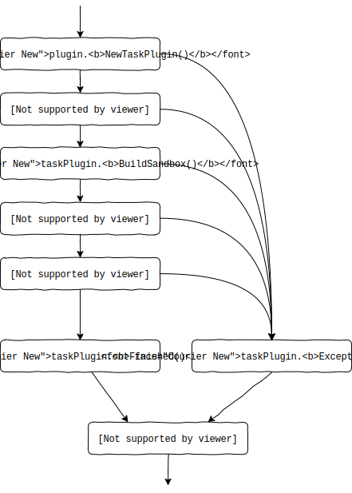

Plugin Life-Cycle
=================
A plugin is always created from a `PluginProvider`. The `PluginProvider` may
specify a JSON schema for the config options it accepts, and when instantiated
it will be passed configuration options and various runtime environment
resources such as log, garbage collector, and life-cycle tracker.

A plugin is usually only instantiated once during a worker process. For testing
purposes it is, however, encouraged for plugins to be reentrant, though this
requirement can be avoided when writing testings.

The methods on a plugin are called as part of the task-processing loop, this
allows to the plugin to call affect the task processing as well as the worker
life-cycle.

The general flow of how the `Plugin` abstractions are called when a task is
processed is outlined in the diagram below:

Implementing Task features
--------------------------
As outlined in the diagram above `Plugin.NewTaskPlugin()` is called, whenever
processing on a new tasks begins. This allows plugins to easily track context
related to a specific tasks and hook into all the events related to that task.

When `TaskPlugin.BuildSandbox(SandboxBuilder)` is called the plugin may operate
on the given `SandboxBuilder` this includes setting environment variables,
attaching proxies, caches etc. Obviously, the plugin has no business calling
`SandboxBuilder.Discard()` or `SandboxBuilder.StartSandbox()`.

Similarly, in `TaskPlugin.Started(Sandbox)` the plugin is invited to interact
with the `Sandbox` creating shells and displays, but clearly the plugin
should not call `Sandbox.WaitForResult()` or `Sandbox.Abort()`. Granted, calling
`Sandbox.Kill()` is a reasonable thing to do, for a plugin implements logic
limiting the task execution time.

Controlling Worker Life-Cycle
-----------------------------
When a plugin is created it is passed a life-cycle tracker as part of the
`runtime.Environment` object. This allows the plugin to stop the worker either
immediately or gracefully. Hence, plugins can limit the worker life-cycle.

To facilitate useful life-cycle logic in plugins each plugin is called when the
worker is idle. The `Plugin.ReportIdle(duration)` method is given the `duration`
of time that the worker has been idle. A plugin can use this initiate a
graceful shutdown only if the machine is idle near the end of a billing cycle.

Additionally, each plugin is also called when a non-fatal internal error occurs.
Most plugins will just ignore this event, and normally the worker would be
configured with at-most one plugin that implements a shutdown heuristic based
on non-fatal internal errors. But this serves to move the decision about what
to do when there is a non-fatal internal error into plugins.
